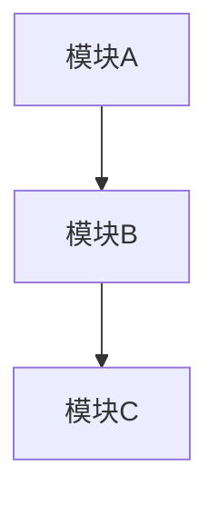

# ADR-YYYY-XXX: [标题]

## 状态

| 状态 | 日期 |
|------|------|
| 📝 提案 | YYYY-MM-DD |
| 🔍 评审中 | YYYY-MM-DD |
| ✅ 已接受 | YYYY-MM-DD |
| ❌ 已拒绝 | YYYY-MM-DD |
| ⚠️ 已废弃 | YYYY-MM-DD |

**当前状态**: 📝 提案

## 元数据

- **ADR 编号**: ADR-YYYY-XXX
- **标题**: [简短描述决策内容]
- **提案人**: [姓名]
- **评审人**: [架构师团队/具体人员]
- **决策人**: [CTO/首席架构师]
- **评审日期**: YYYY-MM-DD
- **相关 ADR**: [ADR 编号]
- **相关 Issue**: [Issue 编号]

---

## 背景

[描述当前情况，为什么要做这个决策]

- 业务背景
- 技术现状
- 面临的挑战
- 为什么现在需要这个决策

## 问题陈述

[清晰定义要解决的问题]

### 当前问题

1. [问题描述1]
2. [问题描述2]
3. [问题描述3]

### 目标

- [业务目标1]
- [技术目标2]
- [性能目标3]

### 约束条件

- [约束1]
- [约束2]
- [约束3]

## 决策驱动因素

### 业务因素

- [ ] 成本效益
- [ ] 市场时机
- [ ] 竞争优势
- [ ] 合规要求
- [ ] 用户体验

### 技术因素

- [ ] 性能要求
- [ ] 可扩展性
- [ ] 可维护性
- [ ] 安全性
- [ ] 技术栈一致性
- [ ] 团队能力

### 运维因素

- [ ] 部署复杂度
- [ ] 监控和诊断
- [ ] 故障恢复
- [ ] 运维成本

## 考虑的方案

### 方案 A: [方案名称]

**描述**：[详细描述方案A]

**优点**：
- 优点1
- 优点2
- 优点3

**缺点**：
- 缺点1
- 缺点2
- 缺点3

**风险**：
- 风险1: [描述和应对措施]
- 风险2: [描述和应对措施]

**成本估算**：
- 开发成本: [人天]
- 运维成本: [月度]
- 迁移成本: [人天]

### 方案 B: [方案名称]

**描述**：[详细描述方案B]

**优点**：
- 优点1
- 优点2
- 优点3

**缺点**：
- 缺点1
- 缺点2
- 缺点3

**风险**：
- 风险1: [描述和应对措施]
- 风险2: [描述和应对措施]

**成本估算**：
- 开发成本: [人天]
- 运维成本: [月度]
- 迁移成本: [人天]

### 方案 C: [方案名称]

**描述**：[详细描述方案C]

**优点**：
- 优点1
- 优点2
- 优点3

**缺点**：
- 缺点1
- 缺点2
- 缺点3

**风险**：
- 风险1: [描述和应对措施]
- 风险2: [描述和应对措施]

**成本估算**：
- 开发成本: [人天]
- 运维成本: [月度]
- 迁移成本: [人天]

## 决策

**选择方案**: [方案名称]

**决策理由**：

[说明为什么选择这个方案，综合考虑了哪些因素]

1. **业务价值**: [方案X 能最好满足业务需求...]
2. **技术优势**: [方案X 在技术上的优势...]
3. **成本效益**: [方案X 的成本效益比最高...]
4. **风险可控**: [方案X 的风险最低或可控...]
5. **实施可行性**: [方案X 最符合团队能力和资源...]

**替代方案的排除理由**：

- [方案Y] 的主要问题是 [理由]
- [方案Z] 的主要问题是 [理由]

## 详细设计

### 架构设计

[详细的架构设计，包括架构图、模块划分、接口定义等]

#### 架构图



#### 模块说明

| 模块 | 职责 | 技术栈 | 依赖 |
|------|------|--------|------|
| ... | ... | ... | ... |

#### 接口设计

```
API: GET /api/v1/resource
功能: ...
参数:
  - param1: ...
  - param2: ...
返回: ...
```

### 数据模型

[数据库表结构、数据流等]

```sql
CREATE TABLE table_name (
    id BIGINT PRIMARY KEY,
    ...
);
```

### 技术栈

| 层级 | 技术选型 | 版本 | 原因 |
|------|----------|------|------|
| 前端 | ... | ... | ... |
| 后端 | ... | ... | ... |
| 数据库 | ... | ... | ... |
| 缓存 | ... | ... | ... |
| 消息队列 | ... | ... | ... |
| 部署 | ... | ... | ... |

### 性能指标

| 指标 | 当前值 | 目标值 | 验证方法 |
|------|--------|--------|----------|
| 响应时间 | ... | ... | ... |
| 吞吐量 | ... | ... | ... |
| 资源占用 | ... | ... | ... |

## 实施计划

### 阶段划分

| 阶段 | 任务 | 负责人 | 预计工期 | 依赖 |
|------|------|--------|----------|------|
| 阶段1 | POC 验证 | ... | ... | ... |
| 阶段2 | 核心开发 | ... | ... | 阶段1 |
| 阶段3 | 测试验证 | ... | ... | 阶段2 |
| 阶段4 | 灰度发布 | ... | ... | 阶段3 |
| 阶段5 | 全量上线 | ... | ... | 阶段4 |

### 里程碑

- [ ] **M1**: YYYY-MM-DD - POC 完成
- [ ] **M2**: YYYY-MM-DD - 核心功能开发完成
- [ ] **M3**: YYYY-MM-DD - 测试通过
- [ ] **M4**: YYYY-MM-DD - 灰度发布
- [ ] **M5**: YYYY-MM-DD - 全量上线

### 资源需求

- **人力**: [人天]
- **预算**: [金额]
- **基础设施**: [服务器/存储/带宽等]

### 风险和应对

| 风险 | 概率 | 影响 | 应对措施 |
|------|------|------|----------|
| ... | 高/中/低 | 高/中/低 | ... |

## 成功标准

### 功能标准

- [ ] 功能 X 实现
- [ ] 功能 Y 实现
- [ ] 功能 Z 实现

### 性能标准

- [ ] 响应时间 < XXX ms
- [ ] 吞吐量 > XXX QPS
- [ ] 资源占用 < XXX%

### 质量标准

- [ ] 测试覆盖率 > XX%
- [ ] 无严重 Bug
- [ ] 代码通过 Review

### 业务标准

- [ ] 用户满意度 > XX%
- [ ] 业务指标提升 XX%

## 监控和验证

### 监控指标

| 指标 | 告警阈值 | 通知方式 |
|------|----------|----------|
| ... | ... | ... |

### 验证方法

1. [验证方法1]
2. [验证方法2]
3. [验证方法3]

### 回滚方案

[如果实施出现问题，如何回滚]

1. 回滚触发条件
2. 回滚步骤
3. 回滚验证

## 评审意见

### 架构师评审

| 评审人 | 投票 | 意见 | 日期 |
|--------|------|------|------|
| ... | ✅/⚠️/❌ | ... | YYYY-MM-DD |

### 决策结论

**最终决策**: [通过 / 有条件通过 / 不通过]

**决策人**: [姓名]

**决策日期**: YYYY-MM-DD

### 通过条件（如有条件通过）

- [ ] 条件1
- [ ] 条件2
- [ ] 条件3

## 实施记录

### 变更日志

| 日期 | 变更内容 | 责任人 |
|------|----------|--------|
| YYYY-MM-DD | ... | ... |

### 问题跟踪

| 问题 | 状态 | 解决方案 | 日期 |
|------|------|----------|------|
| ... | 打开/已关闭 | ... | YYYY-MM-DD |

### 经验教训

[实施过程中的经验教训，用于后续改进]

1. ...
2. ...
3. ...

## 相关文档

- [架构设计文档](链接)
- [技术设计文档](链接)
- [API 文档](链接)
- [测试报告](链接)
- [监控大盘](链接)

## 变更历史

| 版本 | 日期 | 变更内容 | 变更人 |
|------|------|----------|--------|
| v1.0 | YYYY-MM-DD | 初始版本 | ... |
| v1.1 | YYYY-MM-DD | 更新实施计划 | ... |

---

**附录**

### 参考资料

- [技术文章/论文链接]
- [同类项目参考]
- [竞品分析]

### 术语表

| 术语 | 定义 |
|------|------|
| ... | ... |

### 签名

**提案人**: _____________
**评审负责人**: _____________
**决策人**: _____________
