# CLAW.AI 架构文档

## 目录

- [系统架构概览](#系统架构概览)
- [技术栈](#技术栈)
- [核心组件](#核心组件)
- [数据流](#数据流)
- [部署架构](#部署架构)
- [扩展性设计](#扩展性设计)

---

## 系统架构概览

CLAW.AI 是一个基于 FastAPI 构建的智能咨询服务平台，采用微服务架构设计，支持对话管理、知识库检索增强生成（RAG）、用户认证、监控告警等核心功能。

### 整体架构图

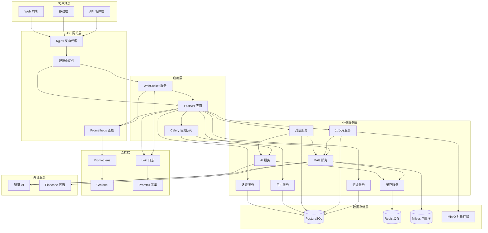

---

## 技术栈

### 后端框架

| 技术 | 版本 | 用途 |
|------|------|------|
| Python | 3.11+ | 主要开发语言 |
| FastAPI | 0.104.1 | Web 框架 |
| Uvicorn | 0.24.0 | ASGI 服务器 |
| Pydantic | 2.5.0 | 数据验证 |
| Celery | 5.3.6 | 异步任务队列 |

### 数据库

| 技术 | 版本 | 用途 |
|------|------|------|
| PostgreSQL | 15 | 主数据库 |
| SQLAlchemy | 2.0.23 | ORM 框架 |
| Alembic | 1.12.1 | 数据库迁移 |
| Redis | 7 | 缓存和会话存储 |
| Milvus | 2.3+ | 向量数据库 |
| Pinecone | - | 可选向量数据库 |

### AI & ML

| 技术 | 版本 | 用途 |
|------|------|------|
| Zhipu AI | 4.0.0 | GLM-4 模型 API |
| LangChain | 0.1.0 | AI 应用框架 |
| Sentence-Transformers | 2.2.2 | 文本嵌入 |

### 监控 & 日志

| 技术 | 版本 | 用途 |
|------|------|------|
| Prometheus | - | 指标收集 |
| Grafana | - | 可视化监控 |
| Loki | - | 日志聚合 |
| Promtail | - | 日志采集 |

---

## 核心组件

### 1. API 网关层

#### Nginx 反向代理
- 负载均衡
- SSL 终止
- 静态文件服务
- 请求路由

#### 限流中间件
- 基于 Token Bucket 算法
- 支持 IP、用户、API 多维度限流
- 配置化限流策略

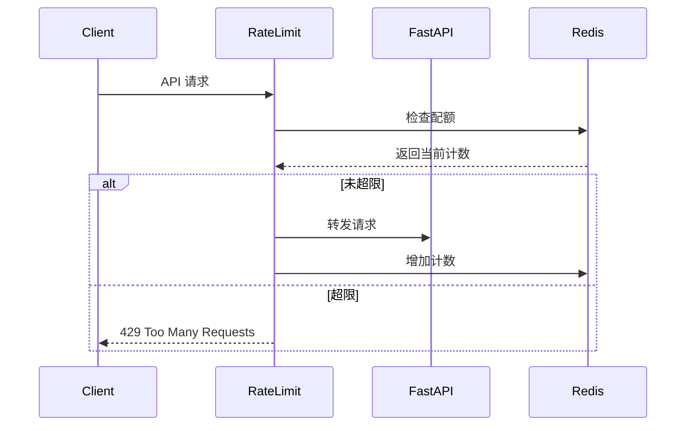

### 2. 应用服务层

#### 认证服务 (AuthService)
- JWT Token 生成和验证
- 用户注册和登录
- 密码加密和验证
- 权限管理

#### 对话服务 (ConversationService)
- 对话 CRUD 操作
- 消息管理
- AI 响应生成
- 对话历史管理

#### 知识库服务 (KnowledgeService)
- 知识库管理
- 文档上传和解析
- 向量索引
- 语义搜索

#### RAG 服务 (RAGService)
- 文档分块
- 向量嵌入
- 相似度检索
- 上下文增强生成

### 3. 异步任务层

#### Celery 任务队列
- 异步 AI 响应生成
- 文档异步索引
- 数据清理任务
- 定时任务调度

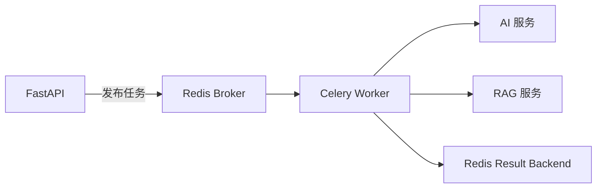

---

## 数据流

### 1. 用户登录流程

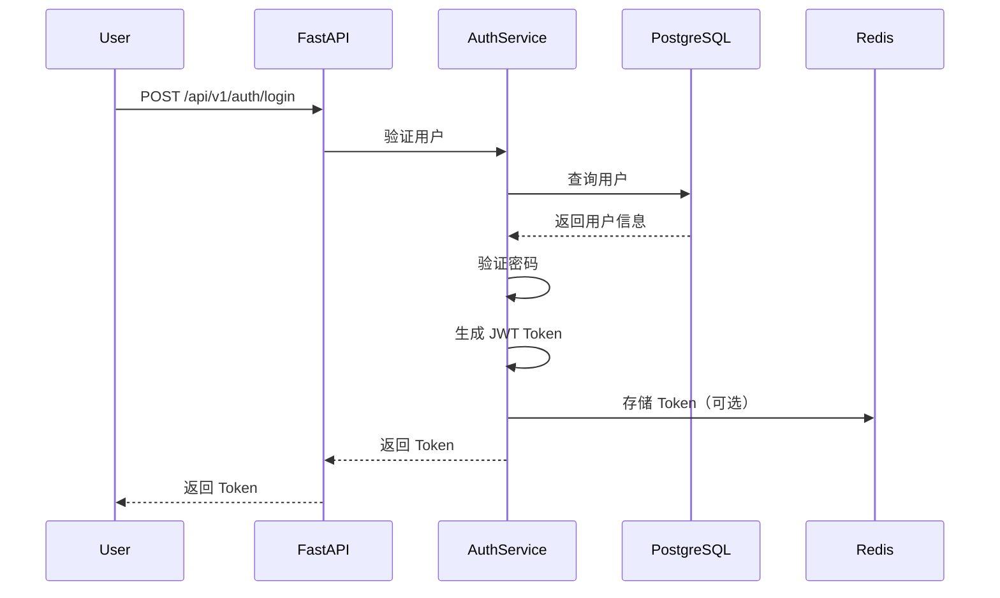

### 2. 对话创建流程

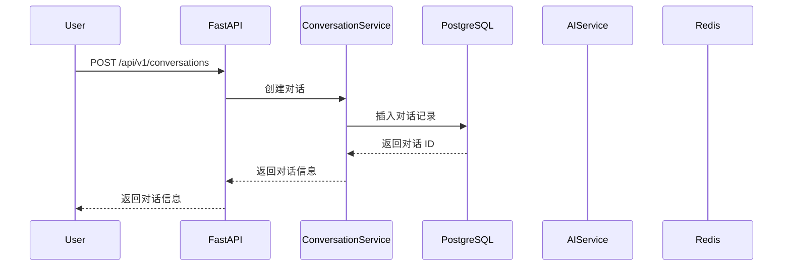

### 3. AI 对话流程

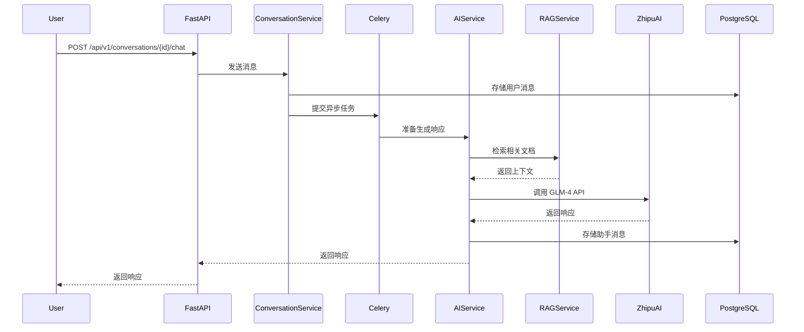

### 4. 知识库文档索引流程

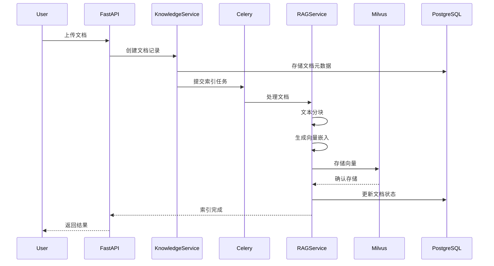

### 5. RAG 查询流程

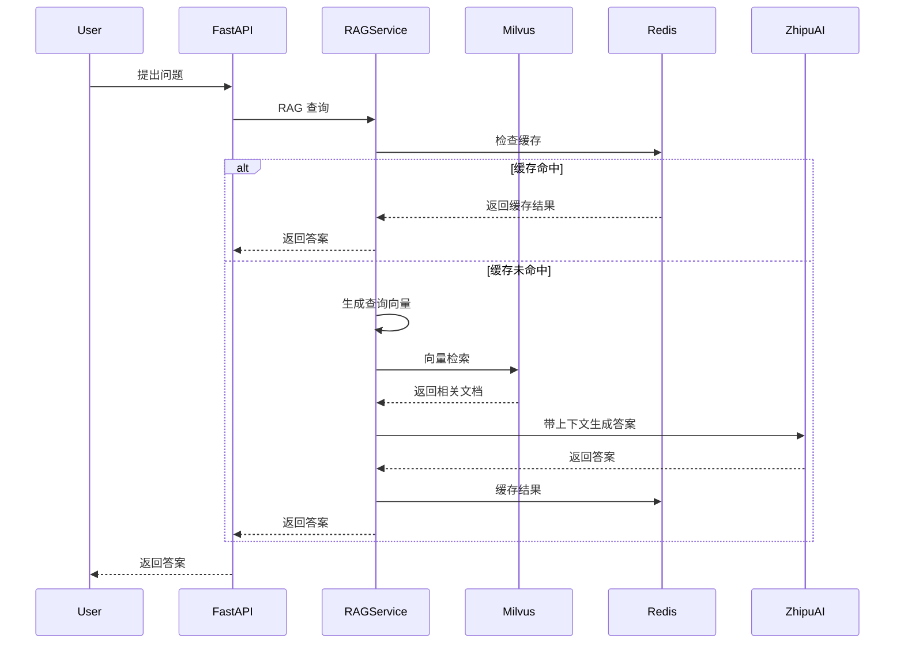

---

## 部署架构

### 生产环境部署架构

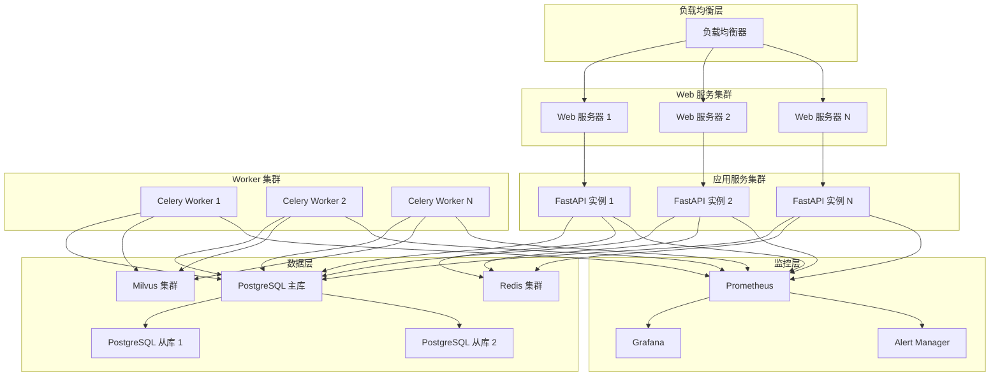

### Docker Compose 部署架构

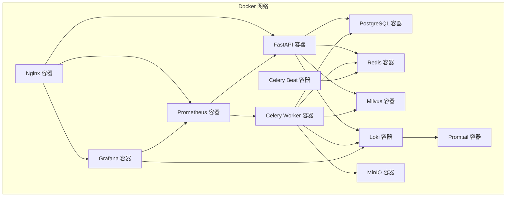

---

## 扩展性设计

### 1. 水平扩展

#### FastAPI 应用实例
- 无状态设计，支持水平扩展
- 通过 Nginx 负载均衡分发请求
- 共享 Redis 缓存和会话

#### Celery Worker
- 支持多 Worker 并行处理
- 任务队列分区提高吞吐量
- 动态扩缩容

### 2. 数据库扩展

#### PostgreSQL 读写分离
- 主库处理写操作
- 从库处理读操作
- 通过 ORM 配置实现自动路由

#### Redis 集群
- 数据分片
- 主从复制
- 自动故障转移

#### Milvus 分布式部署
- 协调节点
- 数据节点
- 查询节点
- 索引节点

### 3. 缓存策略

#### 多级缓存
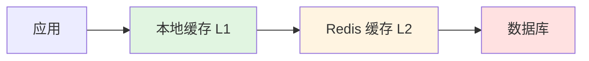

- L1: 内存缓存（Python dict）
- L2: Redis 缓存
- L3: 数据库

#### 缓存失效策略
- TTL 过期
- 主动更新
- 延迟双删

---

## 安全架构

### 1. 认证与授权

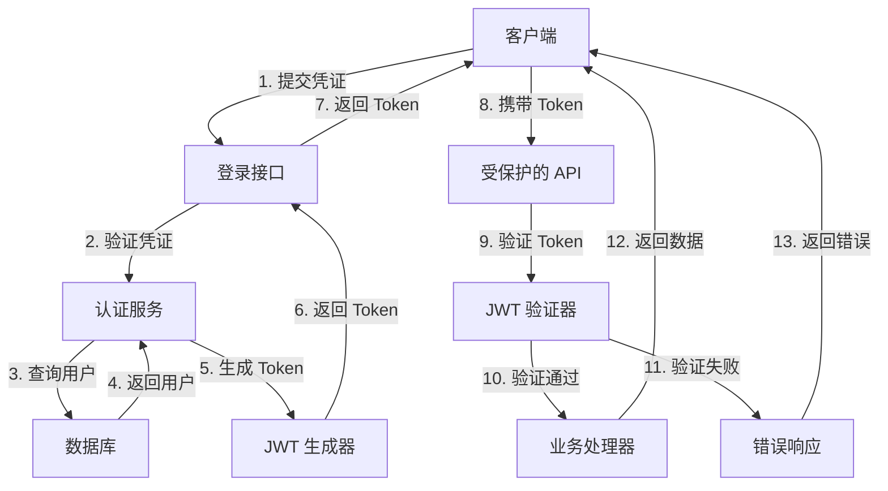

### 2. 数据安全

- 密码使用 bcrypt 加密
- 敏感数据传输使用 HTTPS
- SQL 注入防护（ORM 参数化查询）
- XSS 防护（输入验证和输出编码）

### 3. API 安全

- CORS 配置
- 限流和防刷
- 请求签名验证（可选）
- API Key 管理（可选）

---

## 性能优化

### 1. 数据库优化
- 索引优化
- 查询优化
- 连接池管理
- 读写分离

### 2. 缓存优化
- 热点数据缓存
- 查询结果缓存
- 会话缓存
- 分布式缓存

### 3. 异步处理
- Celery 异步任务
- WebSocket 实时通信
- 异步 I/O 操作

### 4. CDN 加速
- 静态资源 CDN
- API 响应缓存

---

## 监控与告警

### 监控指标

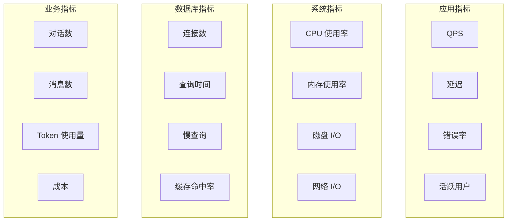

### 告警策略
- P0: 服务不可用（立即告警）
- P1: 性能严重下降（5 分钟告警）
- P2: 性能轻微下降（30 分钟告警）
- P3: 潜在问题（1 小时告警）

---

## 版本历史

| 版本 | 日期 | 说明 |
|------|------|------|
| 1.0.0 | 2024-02-14 | 初始版本 |

---

*最后更新：2024-02-14*
