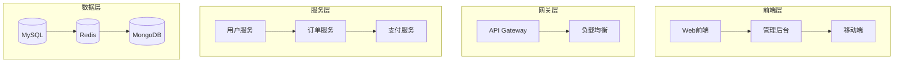
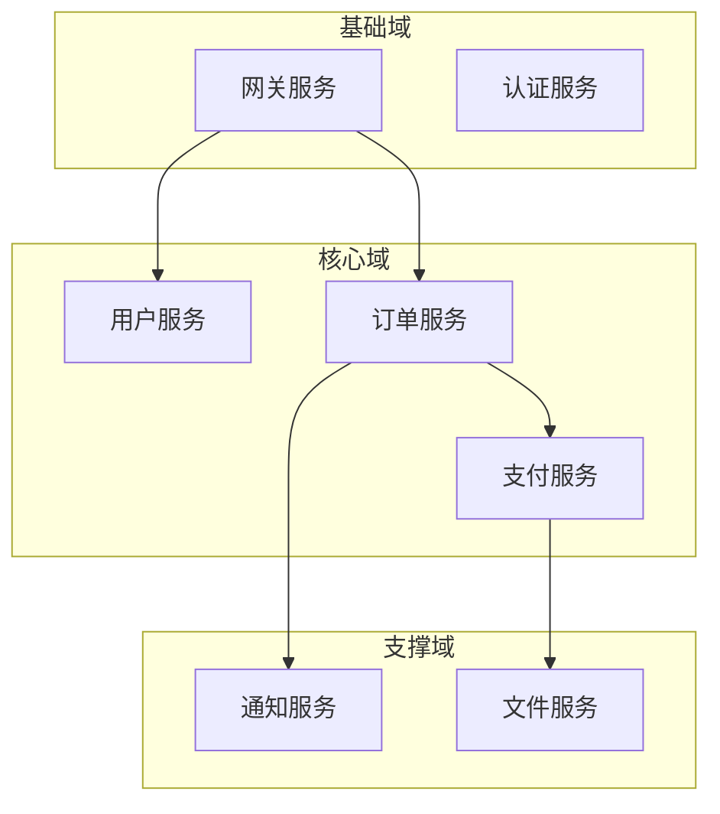
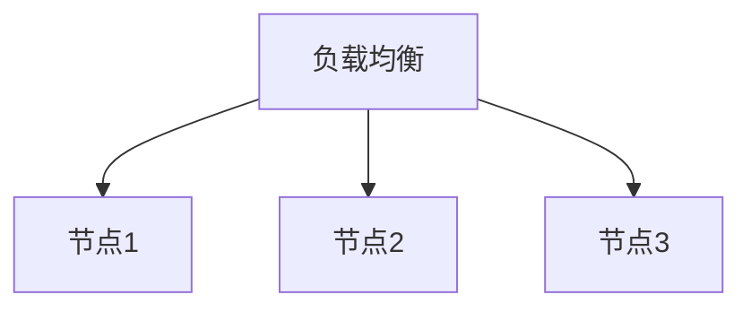

# CLAW.AI 架构文档体系

## 1. 概述

本文档定义了 CLAW.AI 项目的架构文档体系，包括文档分类、内容要求、维护流程等，确保架构知识的高效管理和传承。

## 2. 文档分类

架构文档体系分为三大类：

| 分类 | 缩写 | 说明 | 维护人 |
|------|------|------|--------|
| 架构设计文档 | ADD | 系统级架构设计 | 架构师团队 |
| 技术设计文档 | TDD | 模块/组件级技术设计 | 技术负责人 |
| 运维设计文档 | ODD | 部署、监控、容灾 | 运维团队 |

## 3. 架构设计文档（ADD）

### 3.1 文档清单

| 文档名称 | 文件路径 | 更新频率 | 维护人 |
|----------|----------|----------|--------|
| 系统架构总览 | `docs/architecture/system-overview.md` | 季度 | 首席架构师 |
| 服务架构图 | `docs/architecture/service-architecture.md` | 月度 | 架构师团队 |
| 数据架构图 | `docs/architecture/data-architecture.md` | 季度 | 数据架构师 |
| 技术栈总览 | `docs/architecture/tech-stack.md` | 月度 | 架构师团队 |
| 部署架构图 | `docs/architecture/deployment-architecture.md` | 月度 | 运维架构师 |
| 安全架构 | `docs/architecture/security-architecture.md` | 季度 | 安全架构师 |
| 性能架构 | `docs/architecture/performance-architecture.md` | 月度 | 性能架构师 |

### 3.2 文档模板

#### 系统架构总览（System Overview）

```markdown
# CLAW.AI 系统架构总览

## 文档元数据

- **版本**: v1.0
- **最后更新**: YYYY-MM-DD
- **维护人**: [姓名]
- **评审周期**: 季度

## 1. 系统概述

### 1.1 业务目标

[描述 CLAW.AI 的核心业务目标和价值主张]

### 1.2 系统定位

[描述系统在整体技术体系中的定位]

### 1.3 核心功能

- [功能1]
- [功能2]
- [功能3]

### 1.4 技术特色

- [特色1]
- [特色2]

## 2. 整体架构

### 2.1 架构图

[Mermaid 架构图或图片]



### 2.2 分层说明

| 层次 | 职责 | 主要组件 |
|------|------|----------|
| 前端层 | 用户交互 | Web、移动端、小程序 |
| 网关层 | 流量入口 | API Gateway、CDN、WAF |
| 服务层 | 业务逻辑 | 微服务集群 |
| 数据层 | 数据存储 | 关系型数据库、缓存、消息队列 |

## 3. 核心设计原则

- [原则1]: [说明]
- [原则2]: [说明]
- [原则3]: [说明]

## 4. 技术栈

详见：[技术栈总览](./tech-stack.md)

## 5. 非功能性需求

### 5.1 性能

- 响应时间: < XXX ms (P95)
- 吞吐量: > XXX QPS
- 并发数: > XXX

### 5.2 可用性

- SLA: 99.9%
- 故障恢复时间: < XXX 分钟
- 数据备份: 每日

### 5.3 可扩展性

- 水平扩展: 支持
- 垂直扩展: 支持
- 弹性伸缩: 支持

### 5.4 安全性

- 数据加密: TLS 1.3
- 认证方式: JWT
- 权限控制: RBAC

## 6. 系统边界

### 6.1 内部系统

- [系统1]: [职责]
- [系统2]: [职责]

### 6.2 外部依赖

- [依赖1]: [接口说明]
- [依赖2]: [接口说明]

## 7. 架构演进路线图

详见：[架构演进路线图](../../claw-intelligence/docs/ARCHITECTURE_ROADMAP.md)

## 8. 架构决策记录（ADR）索引

- [ADR-YYYY-XXX]: [标题](../adr/YYYY-MM-DD-title.md)
- [ADR-YYYY-XXX]: [标题](../adr/YYYY-MM-DD-title.md)

## 9. 变更历史

| 版本 | 日期 | 变更内容 | 变更人 |
|------|------|----------|--------|
| v1.0 | YYYY-MM-DD | 初始版本 | ... |
```

#### 服务架构图（Service Architecture）

```markdown
# CLAW.AI 服务架构图

## 1. 服务清单

| 服务名称 | 职责 | 技术栈 | 依赖服务 | 负责人 |
|----------|------|--------|----------|--------|
| 用户服务 | 用户管理、认证授权 | Spring Boot | ... | ... |
| 订单服务 | 订单管理、流程控制 | Spring Boot | 用户服务、库存服务 | ... |
| ... | ... | ... | ... | ... |

## 2. 服务拓扑图



## 3. 服务交互

### 3.1 同步交互

| 调用方 | 被调用方 | 协议 | 超时 | 熔断 |
|--------|----------|------|------|------|
| ... | ... | HTTP | 3s | 是 |

### 3.2 异步交互

| 发送方 | 接收方 | 消息队列 | 消息格式 | 重试 |
|--------|----------|----------|----------|------|
| ... | ... | RabbitMQ | JSON | 3次 |

## 4. 服务治理

### 4.1 服务发现

- 注册中心: [Nacos / Consul / Eureka]
- 健康检查: 每 30 秒
- 实例剔除: 3 次失败后

### 4.2 负载均衡

- 策略: 轮询 / 随机 / 加权
- 会话保持: 是/否

### 4.3 熔断降级

- 熔断器: Hystrix / Sentinel / Resilience4j
- 降级策略: [说明]

### 4.4 限流

- 限流器: [说明]
- 限流策略: [说明]
```

#### 技术栈总览（Tech Stack）

```markdown
# CLAW.AI 技术栈总览

## 1. 前端技术栈

| 层级 | 技术选型 | 版本 | 用途 | 文档 |
|------|----------|------|------|------|
| 框架 | Vue.js | 3.x | 核心框架 | [链接] |
| UI组件 | Element Plus | 2.x | 组件库 | [链接] |
| 状态管理 | Pinia | 2.x | 状态管理 | [链接] |
| 构建工具 | Vite | 5.x | 构建工具 | [链接] |
| ... | ... | ... | ... | ... |

## 2. 后端技术栈

| 层级 | 技术选型 | 版本 | 用途 | 文档 |
|------|----------|------|------|------|
| 语言 | Java | 17 | 主要开发语言 | [链接] |
| 框架 | Spring Boot | 3.x | 应用框架 | [链接] |
| ORM | MyBatis Plus | 3.x | 数据库操作 | [链接] |
| ... | ... | ... | ... | ... |

## 3. 数据库技术栈

| 类型 | 技术选型 | 版本 | 用途 | 规模 |
|------|----------|------|------|------|
| 关系型 | MySQL | 8.0 | 主数据库 | ... |
| 缓存 | Redis | 7.x | 缓存/会话 | ... |
| 文档 | MongoDB | 6.x | 日志/文档 | ... |
| ... | ... | ... | ... | ... |

## 4. 中间件技术栈

| 类型 | 技术选型 | 版本 | 用途 | 配置 |
|------|----------|------|------|------|
| 消息队列 | RabbitMQ | 3.x | 异步消息 | ... |
| 搜索引擎 | Elasticsearch | 8.x | 全文搜索 | ... |
| 任务调度 | XXL-Job | 2.x | 定时任务 | ... |
| ... | ... | ... | ... | ... |

## 5. 运维技术栈

| 类型 | 技术选型 | 版本 | 用途 | 文档 |
|------|----------|------|------|------|
| 容器 | Docker | 24.x | 容器化 | [链接] |
| 编排 | Kubernetes | 1.28.x | 集群管理 | [链接] |
| 监控 | Prometheus | 2.x | 监控采集 | [链接] |
| 日志 | ELK Stack | 8.x | 日志收集 | [链接] |
| ... | ... | ... | ... | ... |

## 6. 开发工具链

| 类型 | 工具 | 版本 | 用途 |
|------|------|------|------|
| IDE | IntelliJ IDEA | 2023.x | Java 开发 |
| IDE | VS Code | 1.8x | 前端开发 |
| 版本控制 | Git | 2.4x | 代码管理 |
| CI/CD | Jenkins / GitLab CI | - | 持续集成 |
| API 文档 | Swagger / Knife4j | - | API 文档 |
| ... | ... | ... | ... |

## 7. 技术选型依据

### 7.1 前端选型

- Vue.js: [理由详见 ADR-XXX]
- Element Plus: [理由详见 ADR-XXX]

### 7.2 后端选型

- Spring Boot: [理由详见 ADR-XXX]
- Java 17: [理由详见 ADR-XXX]

### 7.3 数据库选型

- MySQL: [理由详见 ADR-XXX]
- Redis: [理由详见 ADR-XXX]

## 8. 技术债务

详见：[技术债务管理](./TECHNICAL_DEBT.md)
```

## 4. 技术设计文档（TDD）

### 4.1 文档清单

| 文档名称 | 文件路径 | 更新频率 | 维护人 |
|----------|----------|----------|--------|
| API 设计规范 | `docs/technical/api-design.md` | 月度 | 后端负责人 |
| 数据库设计文档 | `docs/technical/database-design.md` | 季度 | DBA |
| 接口定义文档 | `docs/technical/interface-definition.md` | 随需求更新 | API 负责人 |
| 算法设计文档 | `docs/technical/algorithm-design.md` | 随需求更新 | 算法工程师 |

### 4.2 文档模板

#### API 设计规范

```markdown
# API 设计规范

## 1. 设计原则

- RESTful 风格
- 版本控制: `/api/v{version}`
- 统一返回格式
- 幂等性保证

## 2. URL 规范

### 2.1 命名规范

- 使用小写字母
- 使用连字符(-)分隔
- 使用复数名词
- 示例: `/api/v1/users`

### 2.2 HTTP 方法

| 方法 | 用途 | 示例 |
|------|------|------|
| GET | 查询资源 | GET /api/v1/users |
| POST | 创建资源 | POST /api/v1/users |
| PUT | 完整更新 | PUT /api/v1/users/{id} |
| PATCH | 部分更新 | PATCH /api/v1/users/{id} |
| DELETE | 删除资源 | DELETE /api/v1/users/{id} |

## 3. 请求规范

### 3.1 请求头

```
Content-Type: application/json
Authorization: Bearer {token}
X-Request-ID: {uuid}
```

### 3.2 查询参数

- 分页: `page`, `size`
- 排序: `sort`
- 过滤: `filter`
- 示例: `/api/v1/users?page=1&size=20&sort=createdAt:desc`

### 3.3 请求体

```json
{
  "field1": "value1",
  "field2": "value2"
}
```

## 4. 响应规范

### 4.1 统一响应格式

```json
{
  "code": 200,
  "message": "success",
  "data": {},
  "requestId": "uuid",
  "timestamp": 1704067200000
}
```

### 4.2 状态码

| 状态码 | 说明 |
|--------|------|
| 200 | 成功 |
| 400 | 请求参数错误 |
| 401 | 未授权 |
| 403 | 禁止访问 |
| 404 | 资源不存在 |
| 500 | 服务器错误 |

### 4.3 分页响应

```json
{
  "code": 200,
  "message": "success",
  "data": {
    "items": [],
    "total": 100,
    "page": 1,
    "size": 20
  }
}
```

## 5. 错误处理

### 5.1 错误响应格式

```json
{
  "code": 400,
  "message": "参数错误",
  "errors": [
    {
      "field": "email",
      "message": "邮箱格式不正确"
    }
  ]
}
```

### 5.2 错误码定义

| 错误码 | 说明 | HTTP 状态码 |
|--------|------|-------------|
| 10001 | 参数错误 | 400 |
| 10002 | 未授权 | 401 |
| ... | ... | ... |

## 6. API 文档工具

- Swagger / Knife4j
- OpenAPI 规范
- 自动生成文档

## 7. 示例

### 7.1 创建用户

**请求**
```
POST /api/v1/users
Content-Type: application/json

{
  "name": "张三",
  "email": "zhangsan@example.com",
  "age": 25
}
```

**响应**
```json
{
  "code": 200,
  "message": "创建成功",
  "data": {
    "id": 1,
    "name": "张三",
    "email": "zhangsan@example.com",
    "age": 25,
    "createdAt": "2024-01-01T00:00:00Z"
  }
}
```

### 7.2 查询用户

**请求**
```
GET /api/v1/users/1
```

**响应**
```json
{
  "code": 200,
  "message": "查询成功",
  "data": {
    "id": 1,
    "name": "张三",
    "email": "zhangsan@example.com",
    "age": 25,
    "createdAt": "2024-01-01T00:00:00Z"
  }
}
```

### 7.3 分页查询

**请求**
```
GET /api/v1/users?page=1&size=20&sort=createdAt:desc
```

**响应**
```json
{
  "code": 200,
  "message": "查询成功",
  "data": {
    "items": [...],
    "total": 100,
    "page": 1,
    "size": 20
  }
}
```
```

#### 数据库设计文档

```markdown
# 数据库设计文档

## 1. 数据库规范

### 1.1 命名规范

- 表名: 小写，下划线分隔，复数形式
- 字段名: 小写，下划线分隔
- 索引名: `idx_表名_字段名`
- 外键名: `fk_表名_字段名`

### 1.2 字段规范

- 必须字段: `id`, `created_at`, `updated_at`, `deleted_at`
- 主键: `BIGINT`, 自增或雪花算法
- 时间戳: `DATETIME` 或 `TIMESTAMP`
- 软删除: `deleted_at`，`NULL` 表示未删除

### 1.3 设计原则

- 范式化: 第三范式
- 冗余: 适度冗余以提升查询性能
- 索引: 合理建立索引
- 分表: 大表分表

## 2. 数据库清单

| 数据库 | 类型 | 用途 | 规模 |
|--------|------|------|------|
| claw_core | MySQL | 核心业务数据 | ... |
| claw_log | MySQL | 日志数据 | ... |
| claw_cache | Redis | 缓存数据 | ... |

## 3. 核心表设计

### 3.1 用户表 (users)

```sql
CREATE TABLE users (
    id BIGINT PRIMARY KEY AUTO_INCREMENT COMMENT '用户ID',
    name VARCHAR(50) NOT NULL COMMENT '用户名',
    email VARCHAR(100) NOT NULL COMMENT '邮箱',
    password_hash VARCHAR(255) NOT NULL COMMENT '密码哈希',
    status TINYINT DEFAULT 1 COMMENT '状态: 1-正常 2-禁用',
    created_at DATETIME DEFAULT CURRENT_TIMESTAMP COMMENT '创建时间',
    updated_at DATETIME DEFAULT CURRENT_TIMESTAMP ON UPDATE CURRENT_TIMESTAMP COMMENT '更新时间',
    deleted_at DATETIME DEFAULT NULL COMMENT '删除时间',
    UNIQUE KEY uk_email (email),
    KEY idx_status (status),
    KEY idx_created_at (created_at)
) ENGINE=InnoDB DEFAULT CHARSET=utf8mb4 COMMENT='用户表';
```

### 3.2 订单表 (orders)

```sql
CREATE TABLE orders (
    id BIGINT PRIMARY KEY AUTO_INCREMENT COMMENT '订单ID',
    order_no VARCHAR(32) NOT NULL COMMENT '订单号',
    user_id BIGINT NOT NULL COMMENT '用户ID',
    amount DECIMAL(10,2) NOT NULL COMMENT '订单金额',
    status TINYINT DEFAULT 1 COMMENT '状态: 1-待支付 2-已支付 3-已完成 4-已取消',
    created_at DATETIME DEFAULT CURRENT_TIMESTAMP COMMENT '创建时间',
    updated_at DATETIME DEFAULT CURRENT_TIMESTAMP ON UPDATE CURRENT_TIMESTAMP COMMENT '更新时间',
    deleted_at DATETIME DEFAULT NULL COMMENT '删除时间',
    UNIQUE KEY uk_order_no (order_no),
    KEY idx_user_id (user_id),
    KEY idx_status (status),
    KEY idx_created_at (created_at),
    CONSTRAINT fk_orders_user_id FOREIGN KEY (user_id) REFERENCES users(id)
) ENGINE=InnoDB DEFAULT CHARSET=utf8mb4 COMMENT='订单表';
```

## 4. 索引设计

### 4.1 索引清单

| 表名 | 索引名 | 类型 | 字段 | 说明 |
|------|--------|------|------|------|
| users | idx_status | 普通索引 | status | 按状态查询 |
| users | uk_email | 唯一索引 | email | 邮箱唯一 |
| ... | ... | ... | ... | ... |

### 4.2 索引优化建议

- 避免 WHERE 条件中使用函数
- 避免 OR 连接多个条件
- 合理使用联合索引
- 定期分析慢查询

## 5. 分表分库策略

### 5.1 分表策略

- 分表依据: [字段]
- 分表数量: [数量]
- 路由算法: [算法]

### 5.2 分库策略

- 分库依据: [字段]
- 分库数量: [数量]
- 路由算法: [算法]

## 6. 数据迁移

### 6.1 迁移脚本

[SQL 迁移脚本]

### 6.2 回滚脚本

[SQL 回滚脚本]

## 7. 备份策略

- 备份频率: 每日
- 保留时长: 30 天
- 备份方式: 全量 + 增量
```

## 5. 运维设计文档（ODD）

### 5.1 文档清单

| 文档名称 | 文件路径 | 更新频率 | 维护人 |
|----------|----------|----------|--------|
| 部署方案 | `docs/operations/deployment.md` | 季度 | 运维负责人 |
| 监控方案 | `docs/operations/monitoring.md` | 月度 | 监控负责人 |
| 容灾方案 | `docs/operations/disaster-recovery.md` | 季度 | 运维负责人 |
| 备份方案 | `docs/operations/backup.md` | 季度 | 运维负责人 |

### 5.2 文档模板

#### 部署方案

```markdown
# 部署方案

## 1. 部署架构

### 1.1 环境划分

| 环境 | 用途 | 配置 | 地址 |
|------|------|------|------|
| 开发环境 | 日常开发 | 2C4G | dev.example.com |
| 测试环境 | 功能测试 | 4C8G | test.example.com |
| 预发环境 | 预发布验证 | 8C16G | pre.example.com |
| 生产环境 | 线上运行 | 16C32G | prod.example.com |

### 1.2 部署拓扑



## 2. 部署方式

### 2.1 容器化部署

- 容器引擎: Docker
- 编排工具: Kubernetes
- 镜像仓库: Harbor

### 2.2 部署流程

1. 代码提交
2. 自动构建镜像
3. 推送到镜像仓库
4. 更新 Deployment
5. 健康检查
6. 流量切换

## 3. 配置管理

### 3.1 配置中心

- 配置中心: Nacos / Apollo
- 配置版本化: Git
- 配置加密: AES-256

### 3.2 环境变量

| 变量名 | 说明 | 示例值 |
|--------|------|--------|
| SPRING_PROFILES_ACTIVE | 环境标识 | prod |
| DB_HOST | 数据库地址 | localhost |
| DB_PORT | 数据库端口 | 3306 |
| ... | ... | ... |

## 4. 发布策略

### 4.1 滚动更新

- 更新策略: RollingUpdate
- 最小可用: 1
- 最大不可用: 1

### 4.2 蓝绿部署

- 蓝环境: 旧版本
- 绿环境: 新版本
- 切换方式: 流量切换

### 4.3 金丝雀发布

- 流量比例: 1% → 10% → 50% → 100%
- 观察指标: 错误率、响应时间
- 回滚策略: 自动回滚

## 5. 部署检查清单

### 5.1 部署前

- [ ] 代码审核通过
- [ ] 测试通过
- [ ] 配置文件确认
- [ ] 回滚方案准备

### 5.2 部署中

- [ ] 健康检查通过
- [ ] 日志正常
- [ ] 监控指标正常
- [ ] 流量切换成功

### 5.3 部署后

- [ ] 功能验证
- [ ] 性能验证
- [ ] 监控观察 30 分钟
- [ ] 通知相关人员

## 6. 回滚方案

### 6.1 回滚触发条件

- 错误率 > 1%
- 响应时间 > 3x
- 核心功能异常
- 数据异常

### 6.2 回滚步骤

1. 停止新流量
2. 切换回旧版本
3. 验证功能正常
4. 排查问题

### 6.3 回滚验证

- [ ] 服务正常启动
- [ ] 健康检查通过
- [ ] 功能验证通过
- [ ] 监控指标正常
```

#### 监控方案

```markdown
# 监控方案

## 1. 监控体系

### 1.1 监控分层

| 层次 | 监控内容 | 工具 |
|------|----------|------|
| 基础层 | CPU、内存、磁盘、网络 | Prometheus + Node Exporter |
| 容器层 | Pod、Service、Ingress | cAdvisor |
| 应用层 | JVM、应用指标 | Micrometer |
| 业务层 | 订单量、支付成功率 | 自定义指标 |

### 1.2 监控拓扑

```
应用 → Micrometer → Prometheus → AlertManager → 通知渠道
                     ↓
                  Grafana
```

## 2. 指标体系

### 2.1 基础指标

| 指标 | 说明 | 阈值 |
|------|------|------|
| CPU 使用率 | CPU 占用 | > 80% |
| 内存使用率 | 内存占用 | > 85% |
| 磁盘使用率 | 磁盘占用 | > 80% |
| 网络流量 | 网络进出 | > 80% |

### 2.2 应用指标

| 指标 | 说明 | 阈值 |
|------|------|------|
| QPS | 每秒请求数 | > 90% |
| 响应时间 | 平均响应时间 | > 1000ms |
| 错误率 | 错误请求比例 | > 1% |
| JVM GC | GC 时间占比 | > 10% |

### 2.3 业务指标

| 指标 | 说明 | 阈值 |
|------|------|------|
| 订单量 | 订单数量 | < 90% |
| 支付成功率 | 支付成功比例 | < 99% |
| 注册量 | 新注册用户 | < 90% |

## 3. 告警规则

### 3.1 告警级别

| 级别 | 说明 | 响应时间 | 通知方式 |
|------|------|----------|----------|
| P0 | 严重故障 | < 5 分钟 | 电话 + 飞书 |
| P1 | 重要告警 | < 15 分钟 | 飞书 |
| P2 | 一般告警 | < 30 分钟 | 邮件 |
| P3 | 提醒信息 | 2 小时内 | 邮件 |

### 3.2 告警规则示例

```yaml
groups:
  - name: application
    rules:
      - alert: HighErrorRate
        expr: rate(http_requests_total{status=~"5.."}[5m]) > 0.01
        for: 2m
        labels:
          severity: P0
        annotations:
          summary: "错误率过高"
          description: "{{ $labels.instance }} 错误率为 {{ $value }}"

      - alert: HighLatency
        expr: histogram_quantile(0.95, rate(http_request_duration_seconds_bucket[5m])) > 1
        for: 5m
        labels:
          severity: P1
        annotations:
          summary: "响应时间过长"
          description: "{{ $labels.instance }} P95 响应时间为 {{ $value }}s"
```

## 4. 日志管理

### 4.1 日志收集

- 收集方式: Filebeat / Fluentd
- 日志格式: JSON
- 日志级别: ERROR / WARN / INFO / DEBUG

### 4.2 日志分析

- 存储后端: Elasticsearch
- 可视化: Kibana
- 保留时长: 30 天

### 4.3 日志查询

- 查询语法: KQL / Lucene
- 常用查询: [示例]

## 5. 监控大盘

### 5.1 系统大盘

- 资源使用情况
- 服务健康状态
- 基础指标趋势

### 5.2 应用大盘

- QPS 趋势
- 响应时间趋势
- 错误率趋势

### 5.3 业务大盘

- 订单量趋势
- 用户活跃度
- 支付成功率

## 6. 监控优化

- 指标采集优化
- 告警规则优化
- 大盘优化
```

## 6. 文档维护

### 6.1 维护责任

| 文档类型 | 维护人 | 审核人 | 更新频率 |
|----------|--------|--------|----------|
| ADD | 架构师团队 | CTO | 季度/月度 |
| TDD | 技术负责人 | 架构师 | 随需求更新 |
| ODD | 运维负责人 | 运维架构师 | 季度/月度 |

### 6.2 更新流程

1. 识别需要更新的文档
2. 创建更新 PR
3. 相关人员 Review
4. 合并更新
5. 通知相关团队

### 6.3 文档审核

- 季度架构会议审核
- 年度全面更新
- 重大变更及时更新

## 7. 文档工具

| 工具 | 用途 | 链接 |
|------|------|------|
| Markdown | 文档编写 | - |
| Mermaid | 图表绘制 | [链接] |
| Confluence | 文档管理 | [链接] |
| Figma | 架构图绘制 | [链接] |
| Draw.io | 流程图绘制 | [链接] |

## 8. 文档质量

- 完整性: 涵盖所有必要内容
- 准确性: 内容准确无误
- 及时性: 及时更新
- 可读性: 清晰易懂

---

**文档版本**：v1.0
**创建日期**：2025-01
**维护人**：架构师团队
**评审周期**：季度
